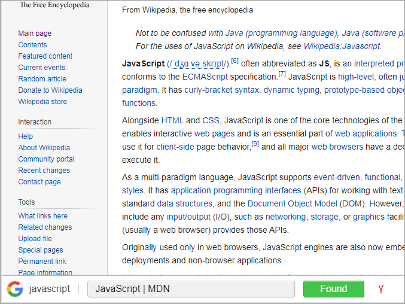
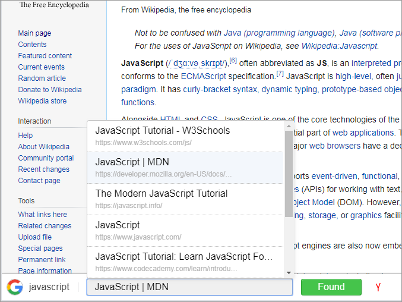

# Handy Search
A Chrome extension which helps to search and navigate on the Internet in a faster way.

## Installation
_For Google Chrome, Vivaldi\*:_

Go to the [extension page](https://chrome.google.com/webstore/detail/handy-search/clhaemfeepnllbbjfkkhlcgbfgnjilnl) in Chrome Web Store. Press the install button.

_\* other Chromium based browsers were not tested_

## Motivation
When one is looking for information, he inevitably gets stacked with a bunch of tabs opened. When the information is found the tabs are not needed anymore and every tab should be closed manually. It would be nice to tell the browser to close them all at once. This is one of the main intents of the extension.

The other thing is that you don't need to switch between tabs to navigate to different pages from a search engine results page, everything is available in one tab.

## Usage examples

The UI of the extension is the notification (toolbar) shown at the bottom of a page. The extension maintains a dynamic list of connected tabs showing the proper notification on every page of a group. Tabs are considered connected if a user navigates using links, navigation in a tab using e.g. address bar disconnects the tab (from a group). There are two use cases when the notification is shown:

### Searching in Google/Yandex
Search for something in Google and navigate to a page from the search results.

The extension notification appears at the bottom of the page holding the search query and other search results pages. You have a choice between navigating to another page using the _Suggests_ button, switching to the Google search results tab or closing other tabs connected to the current tab using the _Found_ button.

  

  

### Navigating between tabs (connected tabs)

The navigation from a page in one tab to another page opened in a new tab groups the tabs together (logically).

The extension notification appears in every tab of the group. In this case the _Suggests_ button is used for switching between the tabs of the group.

## Features

* The _Suggests_ button works in two modes: as a button on short click and as a select on holding left mouse button. Middle mouse button click opens a page in a new tab.

* For a faster navigation consider using hot keys:  
`Ctrl+Shift+F` Found action 
`Ctrl+Shift+K` The Next page 
`Ctrl+M` Minimize/Restore the notification  
These are the recommended hot keys for the extension. A user environment settings could interfere. In this case the hot keys could be changed on the Browser Extensions Settings page.

* The notification is fully accessible with a keyboard.

## Special notes

* An extension content-scripts don't work on Chrome Web Store pages. Therefore the extension is not working on https://chrome.google.com/webstore/... pages.

* Vivaldi browser `chrome API` implementation is not fully compatible to Google Chrome one. Due to the differences there are some cases when the notification is not shown in Vivaldi browser on the pages opened in a new tab (e.g. opening with the middle mouse button instead of following a link with `target="_blank"`).

* Hot keys are not working in Vivaldi browser.
